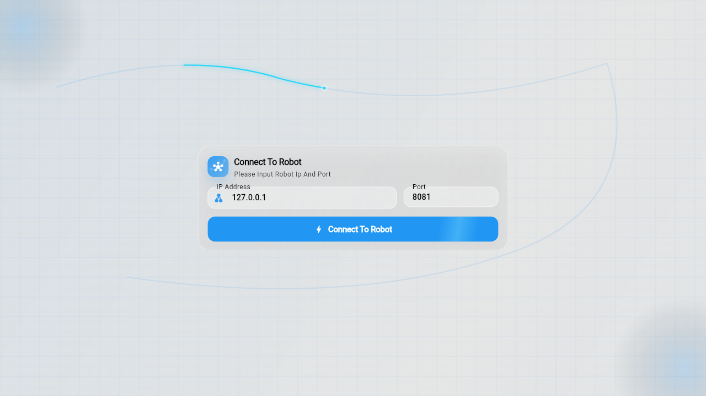

# Navbot Robot Flutter Client


[中文](README_ZH.md)

This repository contains only the **Navbot Robot Flutter frontend**. It connects to a robot, renders telemetry, and provides controls on Android, Web, Windows, Linux, macOS, and iOS.

Robot-side service source and `.proto` source files are not included. At runtime the client requires a robot that already exposes compatible HTTP, WebSocket, and video endpoints. Normal builds use the generated Dart protobuf files committed to this repository.

Companion robot-side deployment: [D1_Backend](https://gitee.com/lookc4/D1_Backend).

> **Repository provenance**
>
> This project was copied from `E:\GitHubD1Demo\D1_Demo` to
> `E:\GitHubProject\Robot_Android`. All subsequent development, builds, and
> documentation maintenance use `E:\GitHubProject\Robot_Android` as the source
> of truth. The original directory is retained only as provenance and is not a
> runtime or build dependency.

## Contents

- [1. Scope and Ownership Boundary](#1-scope-and-ownership-boundary)
- [2. Features](#2-features)
- [3. Runtime Architecture](#3-runtime-architecture)
- [4. Requirements and Endpoints](#4-requirements-and-endpoints)
- [5. Quick Start and Builds](#5-quick-start-and-builds)
- [6. Control Summary](#6-control-summary)
- [7. Repository Layout and Documentation](#7-repository-layout-and-documentation)
- [8. Safety and Known Limitations](#8-safety-and-known-limitations)
- [9. License](#9-license)

## 1. Scope and Ownership Boundary

This repository owns:

- Flutter UI and platform projects.
- Connection, reconnection, and client-side settings.
- Map, telemetry, camera, diagnostic, SSH, and control presentation.
- Virtual and physical gamepad input.
- Generated Dart protobuf types required by the current client.

This repository does not own:

- Robot-side HTTP/WebSocket services.
- ROS 2 nodes, CAN interfaces, D1 drivers, policy models, or systemd services.
- The protocol source files used to generate the committed Dart types.
- Robot-side authentication, access-point configuration, or physical emergency stop.

## 2. Features

- Robot connection and automatic reconnection
- Tiled map, pose, laser, point cloud, paths, trace, and costmaps
- On-screen joysticks and Android/Windows physical gamepads
- Stand, lie-down, and reinforcement-learning mode commands
- Navigation goals, relocation, navigation cancellation, and map editing
- Battery, GPS, odometry, navigation status, and diagnostics
- Floating MJPEG camera view
- SSH quick commands and interactive terminal
- Chinese/English UI, orientation settings, and control logs

<p align="center">
  
</p>

## 3. Runtime Architecture

```text
Android / Web / Desktop Flutter client
  ├─ GET/POST settings, map, and navigation HTTP APIs
  ├─ /ws/robot binary state and control channel
  ├─ /ws/ssh optional SSH tunnel
  └─ :8080 optional MJPEG camera stream
             │
             ▼
     Externally deployed D1 service
             │
             ▼
        D1 robot runtime
```

The frontend never configures CAN, starts robot services, or substitutes for a hardware emergency stop.

## 4. Requirements and Endpoints

- Flutter `3.44.8`
- Dart `>=3.12.0 <4.0.0`
- A reachable robot control service, normally `http://<robot-ip>:8081`
- A reachable MJPEG stream on port `8080` when camera display is used

Default endpoints:

| Purpose | Address |
| --- | --- |
| Settings and control HTTP APIs | `http://<robot-ip>:8081` |
| Robot binary WebSocket | `ws://<robot-ip>:8081/ws/robot` |
| SSH tunnel WebSocket | `ws://<robot-ip>:8081/ws/ssh` |
| MJPEG video | `http://<robot-ip>:8080/stream?topic=/image_raw` |

The connection screen supports a manually entered address and the fixed D1 hotspot endpoint `192.168.50.1:8081`. Android can open the system Wi-Fi list; Web users must join the hotspot manually because browsers cannot change the operating system's active Wi-Fi network.

## 5. Quick Start and Builds

Run Flutter commands from `app`:

```bash
cd app
flutter pub get
flutter run
```

Common release builds:

```bash
flutter build apk --release
flutter build web --release
flutter build windows --release
flutter build linux --release
```

Generated Dart protobuf code is kept in `app/lib/protobuf/`; normal development and packaging do not require a code-generation step.

## 6. Control Summary

| Control | Function |
| --- | --- |
| Left virtual/physical stick | Forward/backward through `MaxVx`; lateral motion through `MaxVy` |
| Right virtual/physical stick | Rotation through `MaxVw` |
| `A` / Stand | Stand command |
| `B` / Lie Down | Lie-down command |
| D-pad Up + `R1` / Enter RL | Enter or exit reinforcement-learning mode |
| `X` | Zoom map in |
| Relocation | Set and confirm the robot's initial pose |
| Navigation point | Open details and send it as a navigation goal |
| Camera | Open/close the camera overlay and switch it to fullscreen |
| Settings | Configure speed, video, topics, SSH, layers, logs, and orientation |

The top-left translational status displays the actual planar command magnitude `sqrt(vx² + vy²)`. `MaxVx` and `MaxVy` remain independent.

For every Map-screen and map-editor button, see the [complete user guide](app/docs/usage.md).

## 7. Repository Layout and Documentation

```text
app/
├── lib/
│   ├── basic/       Data models and coordinate transforms
│   ├── display/     Map layers and robot visualization
│   ├── page/        Connection, main, settings, and log screens
│   ├── provider/    HTTP, WebSocket, map, and global state
│   ├── protobuf/    Generated Dart protobuf code
│   └── ssh/         SSH tunnel client
├── thirdparty/      Local gamepad plugins
├── assets/          Icons and fonts
└── docs/            Frontend usage and communication notes
```

More documentation:

- [Frontend development](app/README.md)
- [User guide](app/docs/usage.md) · [中文](app/docs/usage_ZH.md)
- [Frontend communication contract](app/docs/navbot_d1_topics_and_payloads.md) · [中文](app/docs/navbot_d1_topics_and_payloads_ZH.md)

English files are the default documents for Git hosting. Chinese translations use the `_ZH.md` suffix.

## 8. Safety and Known Limitations

- The current UI has no independent emergency-stop button. Keep a physical or robot-side emergency stop available.
- Suspend the robot for its first motion test.
- A WebSocket write or accepted mode ACK does not prove that a physical action completed.
- The Web client cannot automatically switch Wi-Fi networks.
- When no map or map metadata is available, the frontend placeholder map is for UI continuity only and must not be used for real navigation.
- Control logging is disabled by default; its button is hidden and no high-frequency control entries are recorded until it is enabled in Settings.

## 9. License

See [app/LICENSE](app/LICENSE).
